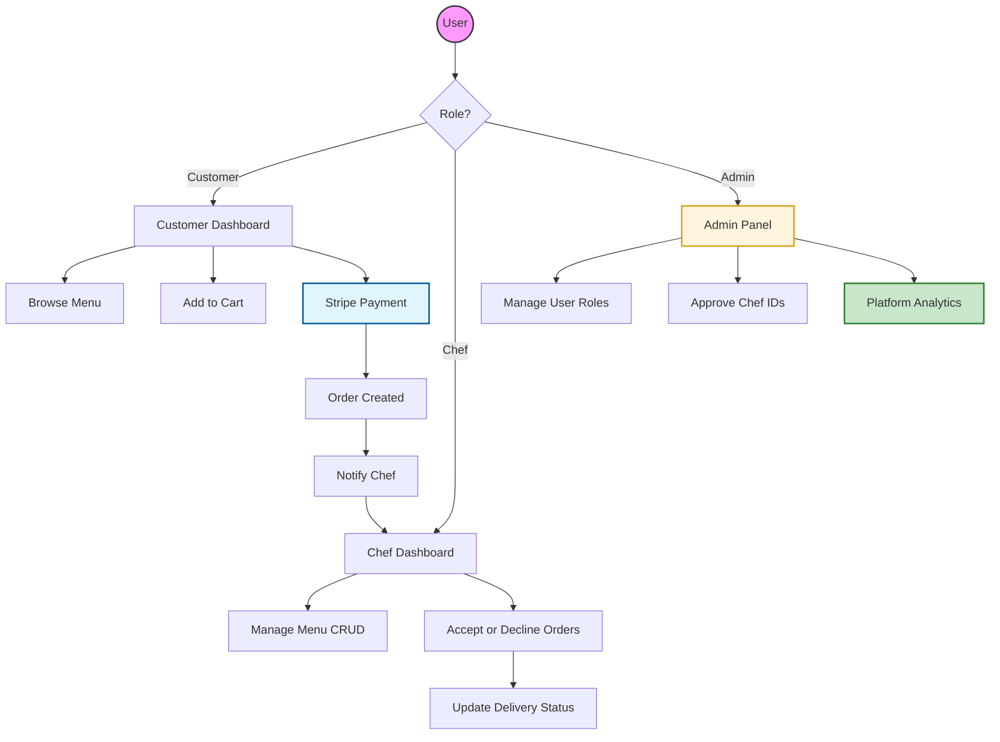

<div align="center">

<p align="center">
  
</p>

# 🍲 LocalChefBazaar

### Premium Home-Chef Marketplace Platform
**Connecting Passionate Home Chefs with Food Lovers Across Bangladesh**

<br/>

[](https://www.mongodb.com/)
[](https://react.dev/)
[](https://stripe.com/)
[](https://firebase.google.com/)
[](https://localchefbazaar.netlify.app)

<br/>

[🌐 Live Demo](https://localchefbazaar.netlify.app) &nbsp;•&nbsp; [💻 Client Repo](https://github.com/rabiulislam5334/localChef-Bazaar-client) &nbsp;•&nbsp; [⚙️ Server Repo](https://github.com/rabiulislam5334/localChef-Bazaar-server)

</div>

---

## 📑 Table of Contents

- [About the Project](#-about-the-project)
- [Key Features](#-key-features)
- [Tech Stack](#-tech-stack)
- [System Architecture](#-system-architecture)
- [Testing Credentials](#-testing-credentials)
- [Quick Start](#-quick-start)
- [Environment Variables](#-environment-variables)
- [Connect](#-connect)

---

## 🌟 About the Project

**LocalChefBazaar** is a premium full-stack MERN marketplace that bridges the gap between passionate home chefs and food lovers. It empowers local chefs to build their own food businesses while giving customers access to fresh, authentic, homemade meals — all in one trusted platform.

> _Building the future of home-cooked food marketplaces. 🇧🇩_

---

## 🚀 Key Features

### 👤 For Customers
- Browse daily menus with smart sorting and category filters
- Save favorite meals and manage a personalized wishlist
- Real-time order tracking from preparation to delivery
- Secure checkout powered by **Stripe**

### 🍳 For Chefs
- Dedicated dashboard for full menu management (Create, Read, Update, Delete)
- Real-time order notifications and acceptance workflow
- Delivery status management and order history

### 🛡️ For Admins
- Centralized control panel for user role management
- Chef ID verification and approval system
- Platform analytics and data visualization via **Recharts**
- Fraud monitoring and account management tools

### ⚡ Technical Highlights
- **Authentication:** Firebase Auth + JWT for secure session management and API protection
- **Animations:** Smooth, modern UI transitions with **Framer Motion** and **GSAP**
- **Data Fetching:** Optimized server state with **TanStack Query**
- **Forms:** Performant, validated forms with **React Hook Form**
- **Responsive Design:** Fully mobile-friendly with **Tailwind CSS**

---

## 💻 Tech Stack

| Category | Technologies |
| :--- | :--- |
| **Frontend** | React 19, React Router DOM, Tailwind CSS, Framer Motion, GSAP, Recharts |
| **Backend** | Node.js, Express.js, JWT, Firebase Admin SDK |
| **Database** | MongoDB, Mongoose |
| **Payments** | Stripe |
| **Auth & Storage** | Firebase Authentication, Firebase Storage |
| **State & Forms** | TanStack Query, React Hook Form |
| **Deployment** | Netlify (Client), Vercel / Render (Server) |

---

## 🏗️ System Architecture



---

## 🔑 Testing Credentials

Explore the full **Admin Dashboard** using the credentials below:

| Role | Email | Password |
| :--- | :--- | :--- |
| **Admin** | `rabiul@khan.com` | `Rabiul@5334` |

> ⚠️ These are read-only demo credentials for testing purposes only.

---

## 🚀 Quick Start

### Prerequisites

- [Node.js](https://nodejs.org/) `v18+`
- [npm](https://www.npmjs.com/) or [yarn](https://yarnpkg.com/)
- A [MongoDB](https://www.mongodb.com/) instance (local or Atlas)
- A [Firebase](https://firebase.google.com/) project
- A [Stripe](https://stripe.com/) account

### Installation

**1. Clone both repositories**

```bash
# Client
git clone https://github.com/rabiulislam5334/localChef-Bazaar-client.git

# Server
git clone https://github.com/rabiulislam5334/localChef-Bazaar-server.git
```

**2. Install dependencies**

```bash
# Frontend
cd localChef-Bazaar-client
npm install

# Backend
cd localChef-Bazaar-server
npm install
```

**3. Set up environment variables**

See the [Environment Variables](#-environment-variables) section below.

**4. Run the project**

```bash
# Start the backend server
cd localChef-Bazaar-server
npm run dev

# Start the frontend client (in a new terminal)
cd localChef-Bazaar-client
npm start
```

Open [http://localhost:3000](http://localhost:3000) to view the app.

---

## ⚙️ Environment Variables

### Client — `.env`

```env
VITE_FIREBASE_API_KEY=your_firebase_api_key
VITE_FIREBASE_AUTH_DOMAIN=your_project.firebaseapp.com
VITE_FIREBASE_PROJECT_ID=your_project_id
VITE_FIREBASE_STORAGE_BUCKET=your_project.appspot.com
VITE_FIREBASE_MESSAGING_SENDER_ID=your_sender_id
VITE_FIREBASE_APP_ID=your_app_id
VITE_STRIPE_PUBLISHABLE_KEY=your_stripe_publishable_key
VITE_API_URL=http://localhost:5000
```

### Server — `.env`

```env
MONGODB_URI=your_mongodb_connection_string
JWT_SECRET=your_jwt_secret_key
STRIPE_SECRET_KEY=your_stripe_secret_key
FIREBASE_ADMIN_SDK=your_firebase_admin_sdk_json
PORT=5000
```

---

## 📬 Connect

Built with ❤️ by **Md. Rabiul Islam**

📧 [rabiulislam5334@gmail.com](mailto:rabiulislam5334@gmail.com)  
🔗 [LinkedIn](https://linkedin.com/in/developerrabiul)  
📂 [GitHub](https://github.com/rabiulislam5334)

---

<div align="center">

**⭐ If you found this project helpful, please give it a star!**

_LocalChefBazaar — Building the future of home-cooked food marketplaces. 🇧🇩_

</div>
